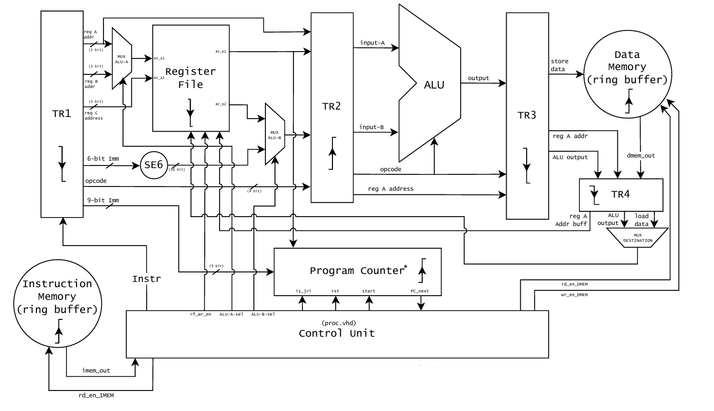

# Pipelined RISC CPU IITB

This repository contains the final submission for the **course project** in **EE309: Microprocessors and Computer Organisation**, Department of Electrical Engineering, **IIT Bombay**, taught by **Prof. Rajbabu Velmurugan**.

<p align="center">
  
</p>

We have designed and implemented a **16-bit pipelined RISC-style CPU** in **VHDL**. This builds on our multicycle CPU from EE224 and extends it with pipelining while retaining component modularity and test compatibility.

---

##  Project Overview

- 16-bit datapath  
- RISC-style ISA  
- Both **multicycle** and **pipelined** processor designs  
- Shared components across both versions  
- Designed for simulation and synthesis in **Quartus Prime**  
- Verified using **ModelSim** testbenches

---

## 📁 Folder Structure

```

Pipelined-RISC-CPU-IITB/
├── src/                     # All VHDL components
│   ├── proc.vhd
│   └── PC_Component.vhd
├── testbench/               # Testbenches common to both CPU versions
├── docs/                    # Report and architecture image
│   ├── datapath.png
│   └── Final_Report.pdf     ← Full project report
├── simulation/              # Residual ModelSim simulation files
└── Code Files/              # Version-specific inserts for Quartus
    ├── mainPipelineProc.txt
    ├── mainMulticycProc.txt
    ├── PC_component_Pipeline.txt
    ├── PC_component_Multicycle.txt
    ├── testbench for pipeline and multi - 1.txt
    ├── testbench for pipeline and multi - 2.txt
    └── testbench for pipeline and multi - 3.txt

```

> 📄 You can find our complete write-up and design documentation in `docs/Final_Report.pdf`.

---

## ⚙️ How to Use (In Quartus Prime)

To run the **multicycle or pipelined** version of the CPU:

1. Open the project in Quartus.
2. In the `src/` folder:
   - Open `proc.vhd` and paste content from:
     - `mainMulticycProc.txt` for **Multicycle**
     - `mainPipelineProc.txt` for **Pipelined**
   - Open `PC_Component.vhd` and paste content from:
     - `PC_component_Multicycle.txt` for **Multicycle**
     - `PC_component_Pipeline.txt` for **Pipelined**

> All other components (ALU, Decoder, Ring Buffer, etc.) are shared between both versions.  

> Testbenches provided will work for both. We’ve included three starter testbenches without hazards to get started.

---

## 👥 Team Members

- **B Yaswanth Ram Kumar** – 23B1277  
- **Sri Charan Raj K** – 23B1229

